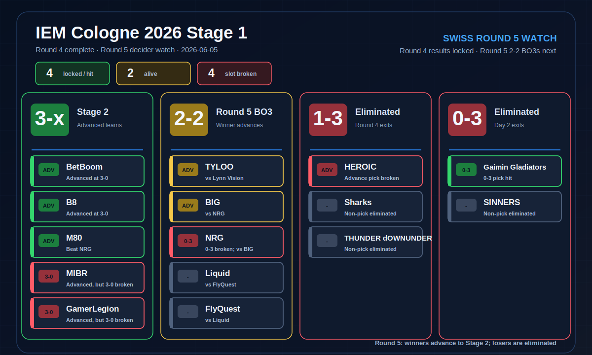

<div align="center">

# CS2 Major Pick'em 助手


**给游戏玩家看的 IEM Cologne 2026 Stage 1 Pick'em 清单、赛程进度和复盘**

[数据处理与建模二级菜单](docs/data-processing.md) ·
[赛前答案 JSON](data/cologne2026/predictions/fivee_6m_stage1_2026-06-01/final_fused_pickem_2026-06-01.json) ·
[Round 4 检查点](data/cologne2026/predictions/fivee_6m_stage1_2026-06-01/final_fused_pickem_checkpoint_round4_2026-06-05.json)

</div>

---

## 这页保留什么

README 只保留游戏玩家最关心的信息：赛前 Pick'em 怎么填、2026-06-05 Round 4 后哪些槽位已经兑现、哪些队还活着、Round 5 应该看哪几场。

数据采集、特征工程、模型训练、命令行参数、回测命令、字段说明和模块说明已经移到 [docs/data-processing.md](docs/data-processing.md)。想复现模型或继续处理数据，从那一页开始。

> 仓库快照停在 **2026-06-05 Round 5 开赛前**。Round 4 赛果已收齐，Stage 1 尚未完赛前仍只写 checkpoint，不提前写最终 Pick'em 回测。

## 赛前提交清单

这是 2026-06-01 的赛前最终融合答案单。融合权重为专家 `0.30`、市场 `0.20`、模型 `0.50`，并把选手样本/替补风险写入 `status_adjusted_score`。

| 槽位 | 队伍 | Round 4 后状态 |
| --- | --- | --- |
| `3-0` | MIBR, GamerLegion | 两队都已晋级 Stage 2，但均为 `3-1`，两个 `3-0` 槽位已失效 |
| `晋级` | BIG, BetBoom, B8, HEROIC, M80, TYLOO | BetBoom、B8、M80 已兑现；BIG、TYLOO 进入 Round 5 仍可兑现；HEROIC 已失效 |
| `0-3` | NRG, Gaimin Gladiators | Gaimin Gladiators 已命中；NRG 已失效 |

> 上表是赛前提交快照，不会因为赛后结果反向修改。

## Round 4 后进度

2026-06-04 Round 4 六场 BO3 已结束，赛果写入 `stage1_round4_results_2026-06-04.csv`，并合并进 `stage1_round1_4_results_2026-06-05.csv` 推导 `stage1_round4_standings_2026-06-05.csv`。Round 4 决出 GamerLegion、MIBR、M80 三个晋级名额，以及 THUNDER dOWNUNDER、Sharks、HEROIC 三个淘汰名额。

<div align="center">



</div>

Pick'em 进度按三类读：

| 状态 | 队伍 | 含义 |
| --- | --- | --- |
| 已兑现 | BetBoom、B8、M80、Gaimin Gladiators | 三个 `晋级` 已进 Stage 2；一个 `0-3` 已命中 |
| 仍可兑现 | BIG、TYLOO | 都是 `晋级` 槽位，Round 5 必须赢 |
| 槽位已失效 | GamerLegion、MIBR、HEROIC、NRG | GamerLegion/MIBR 已晋级但不是 `3-0`；HEROIC 已淘汰；NRG 已无法 `0-3` |

Round 4 后战绩池：

| 战绩池 | 队伍 | 下一步 |
| --- | --- | --- |
| `3-0 / 已晋级` | BetBoom、B8 | 进入 Stage 2 |
| `3-1 / 已晋级` | GamerLegion、MIBR、M80 | 进入 Stage 2 |
| `2-2` | TYLOO、Lynn Vision、Liquid、FlyQuest、NRG、BIG | Round 5 决胜 BO3，胜者进 Stage 2，负者出局 |
| `1-3 / 已淘汰` | THUNDER dOWNUNDER、Sharks、HEROIC | Stage 1 结束 |
| `0-3 / 已淘汰` | SINNERS、Gaimin Gladiators | Stage 1 结束 |

## Round 5 关键赛程

以下是 2026-06-05 的 Round 5 fixtures 快照，以 [esports.gg](https://esports.gg/news/counter-strike-2/iem-cologne-major-2026-stage-1-overview-results/) 的 Stage 1 results/schedule 为主，并用 [HLTV Major hub](https://www.hltv.org/major) 与 [bo3.gg 赛程报道](https://bo3.gg/news/big-to-face-nrg-for-a-spot-in-iem-cologne-major-2026-stage-2) 交叉核对。源文件是 `stage1_round5_fixtures_2026-06-05.csv`；合并 Round 4 standings 后的版本是 `stage1_round5_fixtures_with_standings_2026-06-05.csv`。

| 战绩池 | 对阵 | 赛制 | Pick'em 关注点 |
| --- | --- | --- | --- |
| `2-2` 决胜战 | TYLOO vs Lynn Vision | BO3 | TYLOO `晋级` 必须赢；14:00 CEST |
| `2-2` 决胜战 | Liquid vs FlyQuest | BO3 | 非 Pick'em 直接项，但决定最后晋级池；17:00 CEST |
| `2-2` 决胜战 | NRG vs BIG | BO3 | BIG `晋级` 必须赢；NRG `0-3` 已失效；20:00 CEST |

Round 5 的核心看点只剩两个 Pick'em 槽位：TYLOO 和 BIG 都需要赢下 BO3 才能把 `晋级` 槽位补到 5 个以上。Stage 1 全部结束后，再用最终 standings 跑 `backtest-pickem` 计算是否达成 5 分通过线。

<details>
<summary>展开 Round 4 逐场结果</summary>

| 轮次 / 战绩池 | 对阵 | 结果 | Pick'em 影响 |
| --- | --- | --- | --- |
| `1-2` 淘汰战 | THUNDER dOWNUNDER vs FlyQuest | FlyQuest 2-1 THUNDER dOWNUNDER | 非 Pick'em 直接项；FlyQuest 进入 Round 5 |
| `1-2` 淘汰战 | TYLOO vs Sharks | TYLOO 2-1 Sharks | TYLOO `晋级` 仍活着，进入 Round 5 |
| `2-1` 晋级战 | GamerLegion vs BIG | GamerLegion 2-0 BIG | GamerLegion 已晋级但 `3-0` 仍错；BIG 掉入 Round 5 |
| `2-1` 晋级战 | MIBR vs Lynn Vision | MIBR 2-1 Lynn Vision | MIBR 已晋级但 `3-0` 仍错；Lynn Vision 掉入 Round 5 |
| `1-2` 淘汰战 | Liquid vs HEROIC | Liquid 2-0 HEROIC | HEROIC `晋级` 已失效；Liquid 进入 Round 5 |
| `2-1` 晋级战 | M80 vs NRG | M80 2-0 NRG | M80 `晋级` 已兑现；NRG `0-3` 仍已失效 |

</details>

<details>
<summary>展开 Day 2 逐场结果（Round 2-3）</summary>

| 轮次 / 战绩池 | 对阵 | 结果 | Pick'em 影响 |
| --- | --- | --- | --- |
| Round 2 `1-0` | B8 vs THUNDER dOWNUNDER | B8 13-11 THUNDER dOWNUNDER | B8 继续保持 `晋级` 路径 |
| Round 2 `0-1` | HEROIC vs Lynn Vision | Lynn Vision 13-11 HEROIC | HEROIC 掉入 `0-2`，晋级容错归零 |
| Round 2 `1-0` | M80 vs Sharks | M80 13-6 Sharks | M80 继续保持 `晋级` 路径 |
| Round 2 `0-1` | MIBR vs TYLOO | MIBR 16-14 TYLOO | MIBR `3-0` 仍已失效；TYLOO 掉入 `0-2` |
| Round 2 `1-0` | GamerLegion vs FlyQuest | GamerLegion 13-11 FlyQuest | GamerLegion 暂时保留 `3-0` 路径 |
| Round 2 `0-1` | SINNERS vs NRG | NRG 13-6 SINNERS | NRG `0-3` 已错 |
| Round 2 `1-0` | BetBoom vs Team Liquid | BetBoom 13-9 Team Liquid | BetBoom 继续保持 `晋级` 路径 |
| Round 2 `0-1` | BIG vs Gaimin Gladiators | BIG 13-1 Gaimin Gladiators | BIG 仍可兑现 `晋级`；Gaimin 进入 `0-2` |
| `2-0` 晋级战 | GamerLegion vs BetBoom | BetBoom 2-0 GamerLegion | BetBoom `晋级` 已兑现；GamerLegion `3-0` 已错 |
| `2-0` 晋级战 | M80 vs B8 | B8 2-0 M80 | B8 `晋级` 已兑现；M80 仍在 `晋级` 路径 |
| `1-1` 调整战 | NRG vs FlyQuest | NRG 13-10 FlyQuest | NRG `0-3` 已错 |
| `1-1` 调整战 | Sharks vs Lynn Vision | Lynn Vision 13-5 Sharks | 非 Pick'em 直接影响 |
| `1-1` 调整战 | Team Liquid vs MIBR | MIBR 13-10 Team Liquid | MIBR `3-0` 已错，但仍可晋级 |
| `1-1` 调整战 | THUNDER dOWNUNDER vs BIG | BIG 13-7 THUNDER dOWNUNDER | BIG `晋级` 仍在路上 |
| `0-2` 淘汰战 | TYLOO vs SINNERS | TYLOO 2-0 SINNERS | TYLOO `晋级` 仍活着；SINNERS 淘汰 |
| `0-2` 淘汰战 | Gaimin Gladiators vs HEROIC | HEROIC 2-0 Gaimin Gladiators | Gaimin Gladiators `0-3` 命中；HEROIC `晋级` 仍活着 |

</details>

## 复盘读数

这里是给玩家看的简版结论；完整命令和诊断字段见 [数据处理与建模二级菜单](docs/data-processing.md#回测与诊断)。

| 层级 | 2026-06-05 快照读数 | 玩家视角结论 |
| --- | --- | --- |
| Day 1 单场 forecast | 有效下注 `3/7`；计入规避方向为 `4/8` | 这版单场模型不能当独立投注信号 |
| 5% margin 重打标 | Day 1 有效 pick 变为 `3/5`；机器推荐可直接输出 `--minimum-margin 0.05` | 低置信 BO1 应该更谨慎 |
| 选手状态信号 | 补入 player-form fixtures 后，5%+player form 的有效 pick 全部带低样本状态风险，命中 `3/5`；叠加状态规避后为 `2/3` | 状态风险能提高命中率但会明显降低覆盖，暂作审查信号 |
| Pick'em 中途状态 | `4 locked / 2 alive / 4 broken` | 提交清单还没终局，至少 4 个槽位已兑现 |
| 槽位分解 | `3-0`: `0/0/2`；`晋级`: `3/2/1`；`0-3`: `1/0/1` | Round 5 只剩 BIG、TYLOO 两个 `晋级` 槽位可补 |
| 候选策略 | `3-0` 建议复查 `extreme_consensus_composite`；`晋级` 和 `0-3` 保持 `status_adjusted_score` | 极端槽位要更重视共识信号，主排序暂不整体替换 |

Stage 1 全部结束前，只做 checkpoint 复盘，不提前计算最终 Pick'em 通过率。

## 赛前预测海报

队标为各战队官方 logo，仅用于赛前结果可视化展示。海报保留原始赛前选择，不随赛果回填。

<div align="center">

**3-0**

 

**晋级 ADVANCE**

  

  

**0-3**

 

</div>

## 静态网站部署

`site/` 是 GitHub Pages 静态站入口。它展示当前 Stage 指挥中心、Swiss/Bracket 推演、AI Desk 文章和数据来源状态。

本地预览：

```bash
PYTHONPATH=src python3 scripts/update_site_data.py --repo-root . --output-dir data/cologne2026/site_updates --disable-primary --disable-fivee
PYTHONPATH=src python3 scripts/export_site_data.py --repo-root . --output-dir site/data
PYTHONPATH=src python3 scripts/generate_ai_articles.py --data-dir site/data --output-dir site/data/ai
python3 -m http.server 8000 --directory site
```

然后打开 `http://localhost:8000`。

自动部署使用 `.github/workflows/pages.yml`，每天北京时间 02:00 更新一次，也可以在 GitHub Actions 手动触发。成功更新的数据快照会提交回仓库，用于下一次源失败时保留上一次有效页面。AI API key 必须放在 GitHub Secrets 的 `AI_API_KEY`，不要写入仓库。

## 技术二级菜单

| 想看什么 | 入口 |
| --- | --- |
| 数据清洗、特征工程、模型融合、市场信号和 Swiss 模拟链路 | [处理链路](docs/data-processing.md#处理链路) |
| 安装、验证、端到端样例 | [安装与验证](docs/data-processing.md#安装与验证) |
| `update`、`train`、`forecast`、`pickem`、`backtest-*` 等命令 | [命令总览](docs/data-processing.md#命令总览) |
| IEM Cologne 2026 数据文件说明 | [赛事数据资产](docs/data-processing.md#iem-cologne-2026-数据资产) |
| 回测口径、策略重打标、完赛后评分入口 | [回测与诊断](docs/data-processing.md#回测与诊断) |
| CSV 字段、项目结构和模块职责 | [数据输入字段](docs/data-processing.md#数据输入字段) |

## 许可

本项目使用 [MIT License](LICENSE)。
