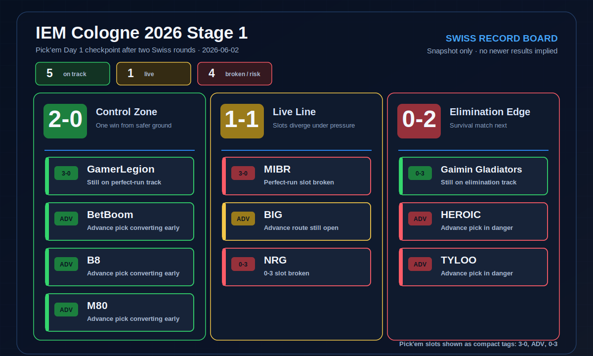
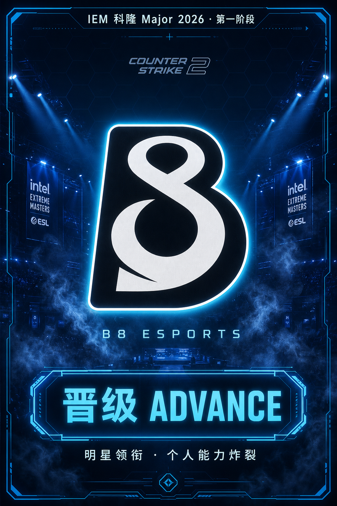
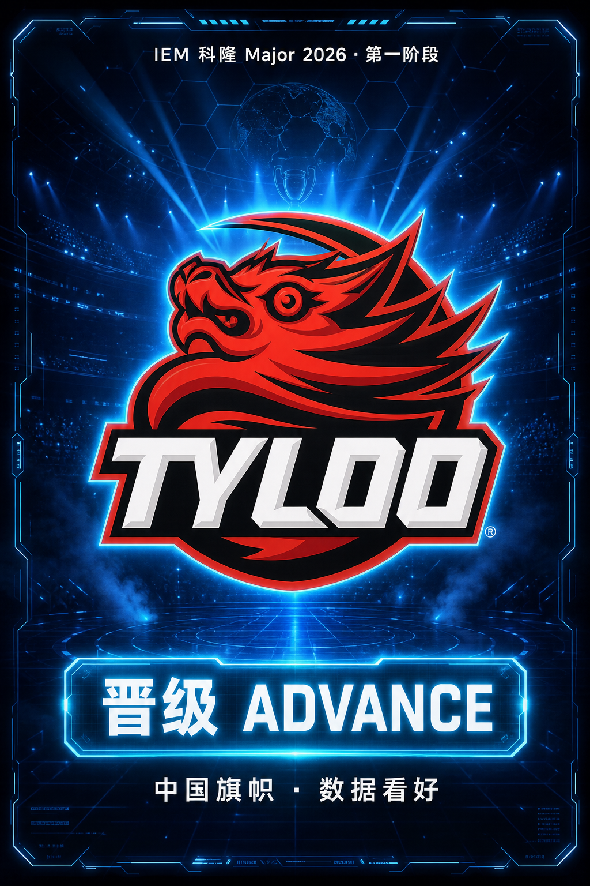
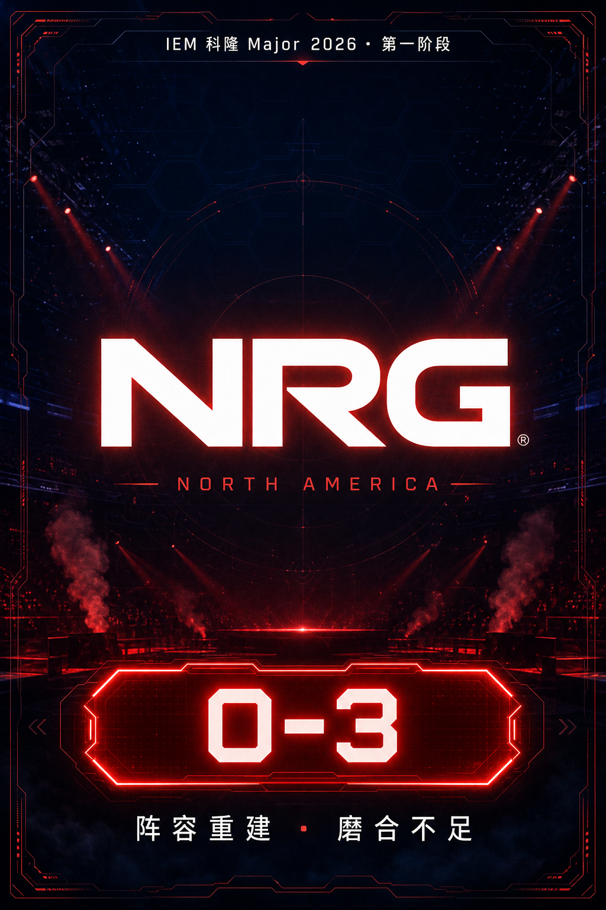
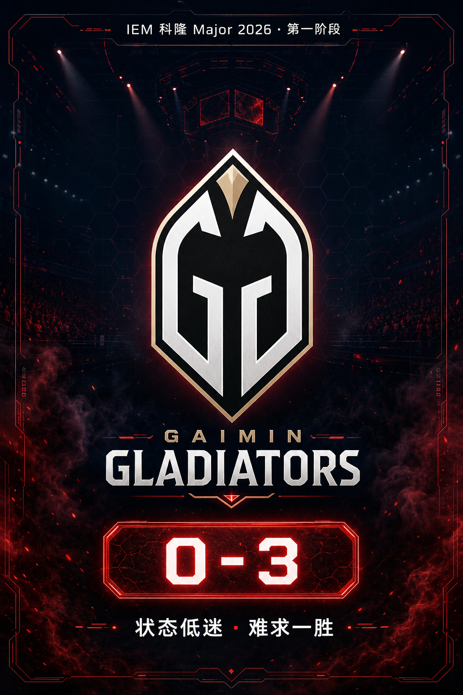

<div align="center">

# CS2 Major Pick'em 机器学习预测系统


**离线可运行的 CS2 Major Pick'em 全链路预测工具**
数据清洗 → 无泄漏特征 → Elo/校准 → 融合模型 → 市场信号审计 → 瑞士轮蒙特卡洛 → Pick'em 策略

[](https://www.python.org/)
[](#安装)
[](#验证)
[](#设计原则)

</div>

---

## 项目简介

`cs2pickem` 是一套面向 CS2 Major **Pick'em 预测**的离线工具链：从原始比赛流水出发，完成数据清洗、无未来泄漏的滚动特征、在线赛前 Elo、按时间切分的训练/验证/测试、验证集概率校准、模型融合、市场赔率/民调信号审计、瑞士轮蒙特卡洛模拟，最终输出带风险控制的 `3-0 / 晋级 / 0-3` 选择清单。

核心包**不依赖任何第三方库**，用系统 Python 即可端到端运行；安装可选依赖后会优先使用 scikit-learn / XGBoost / joblib 加速逻辑回归、随机森林与 XGBoost 分量。任一加速依赖缺失或导入失败时，会自动回退到纯 Python 实现。神经网络分量默认保留纯 Python 路径且默认权重为 0，只有显式设置 `CS2PICKEM_ACCELERATED_MLP=1` 才尝试 sklearn MLP。

## 核心特性

- **零依赖即可运行** —— 核心链路只用标准库，`ml` / `scrape` / `viz` 可选依赖按需增强。
- **无未来数据泄漏** —— 滚动特征、赛前 Elo、选手窗口、赔率/BP 合并全部按比赛日期截断，并默认剔除不稳定身份特征。
- **三模型主栈 + 可审计融合** —— 默认主栈为 LogisticRegression / RandomForest / XGBoost，原始权重 `0.20/0.30/0.35/0.00`，模型内部归一化；纯 Python NN 作为保底组件保留。
- **概率校准与回归验证** —— 训练报告与 `optimize-matches` 支持按时间切分、滚动验证、Brier/ECE/Log Loss、Platt 校准、with/without Elo 对比。
- **市场信号有边界** —— 真赔率会参与轻量修正；HLTV fan poll 等民调只作为 proxy 报告，不直接当赔率使用。
- **瑞士轮蒙特卡洛** —— 蛇形种子配对、同战绩优先、避免复赛，BO3 晋级/淘汰自动处理。
- **风险感知策略** —— 赔率修正、低置信规避、弱队爆冷降权、挑战者/传奇组分层加权。
- **上线门槛审计（readiness）** —— 数据量、字段完整性、模型指标、融合优势、回测通过率、数据源新鲜度一键体检。
- **一键编排（pipeline）** —— 采集后数据 → 训练 → 预测 → 模拟 → 审计 → 最终答案单，全流程串联。

## 处理链路

<p align="center">
  
</p>

| 阶段 | 模块 | 说明 |
| --- | --- | --- |
| 1. 数据清洗 | `cleaning` | 过滤二队/Mix/弃赛/低级别赛事、剔除 3σ 异常值、填充 H2H 中性默认值 |
| 2. 特征工程 | `features` `enrichment` `reliability` | 排名差、RMR 差、Major 历史差、近期胜率、地图胜率、选手状态、赛前 Elo、瑞士轮状态等 |
| 3. 时间切分 | `splitting` | 按时间顺序拆分 train/val/test，提供时间序列交叉验证折，带防泄漏日期边界 |
| 4. 模型融合 | `models` `predictor` | Logistic / RandomForest / XGBoost 主栈，自动记录后端、权重、超参数与特征准备策略 |
| 5. 校准调参 | `calibration` `tuning` | 验证集 Platt 校准、滚动 fold 评估、候选模型/Top-K/Elo/市场权重对比 |
| 6. 市场信号 | `odds` `forecast` `pickem` | 十进制赔率、5E 别名、美式赔率、显式市场概率、HLTV poll proxy 的统一解析与审计 |
| 7. Pick'em 策略 | `swiss` `strategy` `selection` | 瑞士轮模拟并输出 `3-0/晋级/0-3` 候选，应用低置信规避和风险分层 |

## 安装

需要 **Python 3.9+**。免安装即可运行（用 `PYTHONPATH=src`），或安装为可编辑包：

```bash
# 方式一：免安装，直接用源码运行
PYTHONPATH=src python3 -m cs2pickem.cli demo

# 方式二：安装为本地包，获得 `cs2pickem` 命令
pip install -e .
cs2pickem demo
```

可选依赖（按需安装，缺失时自动回退）：

```bash
pip install -e ".[ml]"      # pandas / numpy / scikit-learn / xgboost / joblib 等 ML 加速依赖
pip install -e ".[scrape]"  # requests / beautifulsoup4（真实抓取）
pip install -e ".[viz]"     # matplotlib（可视化导出）
pip install -e ".[dev]"     # pytest
```

> `.[ml]` 中仍声明了实验性依赖（如 TensorFlow / imbalanced-learn），但默认模型路径不依赖 TensorFlow。当前推荐的加速后端是 scikit-learn + XGBoost + joblib。

下文命令以免安装写法 `PYTHONPATH=src python3 -m cs2pickem.cli <cmd>` 为例；安装后可直接用 `cs2pickem <cmd>`。

## 验证

```bash
# 运行全部单元测试
PYTHONPATH=src python3 -m unittest discover -s tests -v

# 用内置样例跑一次端到端演示
PYTHONPATH=src python3 -m cs2pickem.cli demo

# 检查当前模型实际使用的后端
PYTHONPATH=src python3 - <<'PY'
from cs2pickem.models import default_ensemble
print(default_ensemble(seed=7, epochs=2, n_jobs=1).component_backends)
PY
```

安装推荐加速依赖后，后端检查通常应类似：

```text
{'logistic': 'sklearn', 'random_forest': 'sklearn', 'xgboost': 'xgboost', 'neural_network': 'pure_python'}
```

## 快速开始

用 `examples/` 里的样例数据跑一次完整离线工作流（采集后的输入 → 训练 → 预测 → 模拟 → 审计 → 答案单）：

```bash
PYTHONPATH=src python3 -m cs2pickem.cli pipeline \
  --history examples/raw_match_history.csv \
  --fixtures examples/upcoming_fixtures.csv \
  --teams examples/sample_teams.csv \
  --odds examples/odds_feed.csv \
  --players examples/player_stats.csv \
  --bp examples/bp_intel.csv \
  --participants examples/major_participants_sample.csv \
  --top-teams examples/top80_teams_sample.csv \
  --version-log examples/version_log.csv \
  --reference-date 2026-05-31 \
  --output-dir /tmp/cs2pickem_pipeline \
  --simulations 100000 --stage challengers --max-age-days 180
```

产物写入 `--output-dir`，包括 `enriched_matches.csv`、`train_report.json`、`forecast_report.json`、`pickem_report.json`、`readiness_report.json`、`pickem_answer_sheet.json` 和 `pipeline_manifest.json`。

## 命令总览

共 29 个子命令，按职责分组：

### 数据采集（本地 HTML 或 `--url` 抓取）

| 命令 | 作用 |
| --- | --- |
| `update` | 抓取/解析 HLTV-like 结果页 → JSON 数据集 + manifest，可增量追加长期训练 CSV |
| `daily-update` | 配置驱动的多源每日增量更新，统一去重追加 + per-job/总 manifest（适配 cron/launchd） |
| `event-teams` | 解析 HLTV-like event 页 → 参赛队伍/种子/排名/晋级来源 CSV |
| `rankings` | 解析 HLTV-like ranking 页 → Top-N 队伍/积分/区域 CSV（默认 `--limit 80`） |
| `player-stats` | 解析 HLTV-like 选手统计页 → Rating/KD/首杀/残局/替补 CSV |
| `fivee-collect` | 低频抓取 5E 战队页 → `fivee_teams/players/maps.csv` + manifest |
| `fivee-match-results` | 反向翻页抓取 5E 全局赛果接口 → 指定日期窗口赛果 CSV |

### 数据处理 / 特征

| 命令 | 作用 |
| --- | --- |
| `enrich` | 原始流水 → 无泄漏滚动特征（近 5/10 场胜率、30 天参赛量、BO 胜率、连胜连败、H2H）+ 队伍地图画像 |
| `merge-odds` | 合并十进制赔率、5E 别名或美式赔率；优先按 `source_match_url`，否则按日期+无序队伍匹配，输出市场概率与匹配审计 |
| `merge-players` | 只读赛前窗口内选手行，合并 Rating/KD/首杀/残局/明星/替补，并生成短期 player form，避免未来泄漏 |
| `merge-bp` | 按日期+无序队伍合并赛前地图 BP 情报（确认地图、双方禁/选图、来源、置信度） |
| `merge-standings` | 把当前 Swiss standings 写回下一轮 fixtures，补齐 `team*_record` 与 `swiss_match_type`，避免中途预测沿用赛前 0-0 状态 |

### 建模 / 评估

| 命令 | 作用 |
| --- | --- |
| `train` | 清洗 → 切分 → 融合训练 → 输出 Accuracy/AUC/LogLoss/盈亏、CV、BO1/BO3 分段、单模型 vs 融合对比 |
| `optimize-matches` | 回放历史比赛，比较模型候选、Top-K 特征、Elo 开关、校准和市场融合权重，输出验证/测试/滚动评估 |
| `visualize` | 训练报告 → 特征重要性图 + 预测概率分布图（Matplotlib PNG，回退 SVG） |

### 预测 / 策略

| 命令 | 作用 |
| --- | --- |
| `forecast` | 赛前 fixtures 单场胜率：模型分量胜率 + 加权贡献 + 市场信号修正 + 选手状态摘要 + 可配置低置信/BO1/选手状态规避 + 候选地图分布 |
| `apply-forecast-policy` | 不重训模型，直接对既有 forecast 报告应用 minimum margin、BO1 margin 和 player form 规避策略，适合赛后快速调参复盘 |
| `pickem` | 用融合模型作为 Swiss 胜率函数 → 蒙特卡洛 → `3-0/晋级/0-3` 清单 + 逐队风险拆解 |
| `simulate` | 输出每队 `3-0/3-1/3-2/0-3/1-3/2-3/晋级/淘汰` 概率与 Pick'em 候选 |
| `answer-sheet` | 把大型 Pick'em + readiness 报告压缩为可提交/复核的最终答案单 |

### 编排 / 审计 / 回测

| 命令 | 作用 |
| --- | --- |
| `pipeline` | 串联 enrich→增强→merge→train→visualize→forecast→pickem→readiness 的一键离线工作流 |
| `readiness` | 上线门槛审计：数据量 ≥8000、字段完整性、名单覆盖、模型指标、融合优势、回测通过率、数据源新鲜度等 |
| `demo` | 用内置样例跑一遍核心链路演示 |
| `backtest-forecast` | 单场 forecast 报告 vs 实际赛果 CSV，输出有效下注命中率、方向命中率、低置信规避、BO1 专用阈值候选、市场修正、favorite upset、player form 和 Swiss 压力诊断 |
| `standings-from-results` | 从逐场赛果 CSV 自动推导 Swiss `team,wins,losses,status` standings，减少手写战绩表错误 |
| `backtest-pickem` | Pick'em 报告 vs 最终 Swiss standings，计算命中数与是否达 pass threshold |
| `checkpoint-pickem` | Pick'em 报告 vs 当前 Swiss standings，输出每个槽位 locked / alive / broken、下一场锁定/破损压力、状态/槽位 confidence 诊断，中途复盘不冒充最终打分 |
| `backtest-pickem-suite` | 多场 Major 的 suite 级通过率汇总（默认目标 38%） |
| `replay-pickem-suite` | 重新训练、生成并评分历史 Pick'em replay cases，避免只测静态旧报告 |

> 每个命令的完整参数见 `cs2pickem <cmd> --help`。

## 端到端示例

从原始数据到最终答案单的关键步骤（更多组合见 `cs2pickem --help`）：

```bash
# 1) 生成滚动特征与地图画像
PYTHONPATH=src python3 -m cs2pickem.cli enrich \
  --matches examples/raw_match_history.csv \
  --output /tmp/enriched.csv --profiles-output /tmp/profiles.json

# 2) 训练融合模型（六个月窗口传 --max-age-days 180）
PYTHONPATH=src python3 -m cs2pickem.cli train \
  --matches examples/sample_matches.csv --reference-date 2026-05-31 \
  --top-k 25 --cv-folds 5 --max-age-days 180 --output /tmp/train_report.json

# 3) 回归验证候选逻辑，重点看验证集/测试集/滚动 fold
PYTHONPATH=src python3 -m cs2pickem.cli optimize-matches \
  --matches /tmp/enriched.csv --reference-date 2026-05-31 \
  --max-age-days 180 --top-k-values 12,18,25 \
  --candidates fast_logistic,random_forest,no_nn \
  --elo-modes with,without --output /tmp/match_tuning_report.json

# 4) 赛前 fixtures 单场预测
PYTHONPATH=src python3 -m cs2pickem.cli forecast \
  --history /tmp/enriched.csv --fixtures examples/upcoming_fixtures.csv \
  --profiles /tmp/profiles.json --reference-date 2026-05-31 --top-k 25 --max-age-days 180 \
  --minimum-margin 0.05 --avoid-player-form-counter-signal

# 5) 瑞士轮蒙特卡洛 + Pick'em 清单
PYTHONPATH=src python3 -m cs2pickem.cli pickem \
  --history /tmp/enriched.csv --teams examples/sample_teams.csv \
  --fixtures examples/upcoming_fixtures.csv --profiles /tmp/profiles.json \
  --reference-date 2026-05-31 --simulations 100000 --stage challengers --max-age-days 180
```

### 合并市场赔率

`merge-odds` 接受三类真实赔率输入：`odds_team1/odds_team2`、5E 常见别名 `team1_odds/team2_odds`、美式赔率 `odds_team1_american/odds_team2_american` 等。合并后会写入 `market_probability_team1`、`market_signal_basis`、`market_signal_source`、`market_signal_proxy`，供 `forecast` / `pickem` 审计和轻量修正。

```bash
# 历史比赛合并 5E 赔率
PYTHONPATH=src python3 -m cs2pickem.cli merge-odds \
  --matches data/cologne2026/predictions/fivee_6m_stage1_2026-06-01/enriched_matches.csv \
  --odds data/cologne2026/processed/fivee_stage1_match_results_6m_2026-06-01.csv \
  --output data/cologne2026/predictions/fivee_6m_stage1_2026-06-01/enriched_matches_with_5e_odds.csv

# 赛前 fixtures 合并开盘美式赔率
PYTHONPATH=src python3 -m cs2pickem.cli merge-odds \
  --matches data/cologne2026/processed/stage1_opening_fixtures_fivee_6m_model_2026-06-01.csv \
  --odds data/cologne2026/source_inputs/opening_match_odds_american_2026-06-01.csv \
  --output data/cologne2026/processed/stage1_opening_fixtures_fivee_6m_model_with_market_odds_2026-06-01.csv
```

民调代理字段 `hltv_poll_team1/hltv_poll_team2` 也会被解析为 `poll_proxy`，但只用于报告，不用于真实赔率修正。

### 关于训练窗口与门槛

- 默认清洗窗口 90 天；赛前六个月训练传 `--max-age-days 180`。
- 严格复现目标日历切分（例如 2026.01-2026.04 / 2026.05 上旬 / 2026.05 下旬）：加 `--train-end-date 2026-04-30 --validation-end-date 2026-05-15`。显式拆分要求 train/val/test 三段都有数据，避免被错误边界切成伪评估。
- 生产级 `readiness` 会强制校验：日历拆分、采集行级范围、验证集调权、50%-52% 低置信单场全部 `avoid`、≥10 万次模拟、完整 `3-0/晋级/0-3` 槽位、每个入选项 ≥4% 选择边际、至少 1 个 Swiss matchup 使用真实赔率、关键数据源不超过赛前窗口快照。

## 数据输入字段

CSV 或字典行建议包含以下列；`readiness` 的字段完整性门槛会要求核心建模列已填充：

- **基础**：`date` `event` `event_tier` `status` `team1` `team2` `winner` `best_of` `map`
- **队伍**：`team{1,2}_rank` `team{1,2}_rmr_points` `team{1,2}_major_best_placement`
- **近期状态**：`team{1,2}_matches_30d` `team{1,2}_recent_winrate_{5,10}` `team{1,2}_bo{1,3}_winrate_6m` `team{1,2}_current_streak`
- **地图**：`team{1,2}_map_winrate`
- **选手**：`team{1,2}_rating` `team{1,2}_kd` `team{1,2}_opening_success` `team{1,2}_clutch_winrate` `team{1,2}_star_rating` `team{1,2}_substitute_flag` `team{1,2}_player_sample` `team{1,2}_player_form_score` `team{1,2}_player_form_trend` `team{1,2}_player_sample_confidence`
- **对局**：`h2h_team1_winrate` `swiss_round` `team{1,2}_wins` `team{1,2}_losses` `version_tag` `source_match_url`
- **市场信号**：`odds_team1` `odds_team2`、`team1_odds` `team2_odds`、`decimal_odds_team1` `decimal_odds_team2`、`odds_team1_american` `odds_team2_american`、`market_probability_team1`、`market_signal_basis`、`market_signal_source`、`market_signal_proxy`、`hltv_poll_team1`、`hltv_poll_team2`
- **BP 情报**：`date` `source` `team1` `team2` `map`/`confirmed_map`/`expected_map` `confidence` `team{1,2}_bans` `team{1,2}_pick`

## 项目结构

```text
CS-AI-bet/
├── src/cs2pickem/            # 核心 Python 包（零三方依赖即可运行）
│   ├── cli.py                # 命令行入口（28 个子命令）
│   ├── pipeline.py / workflow.py   # 一键离线工作流编排
│   ├── cleaning.py           # 数据清洗
│   ├── enrichment.py         # 无泄漏滚动特征 + 队伍地图画像
│   ├── reliability.py        # 在线赛前 Elo + 不稳定身份特征屏蔽
│   ├── calibration.py        # Platt 概率校准
│   ├── tuning.py             # optimize-matches 回归验证与候选调参
│   ├── features.py / selection.py / imbalance.py
│   ├── models.py / predictor.py / evaluation.py / splitting.py
│   ├── swiss.py / pickem.py / strategy.py / forecast.py
│   ├── sources.py / update.py / fivee.py / dataset_store.py
│   ├── odds.py / players.py / bp.py / maps.py / ratings.py
│   └── readiness.py / backtest.py / export.py / visualization.py
├── tests/                    # 单元测试（标准库 unittest）
├── examples/                 # 样例 CSV/HTML/JSON 输入
├── data/                     # IEM Cologne 2026 真实数据与预测产物
│   ├── cologne2026/          # raw / processed / manifests / predictions / source_inputs
│   └── fivee/                # 5EPlay 抓取数据
├── docs/                     # 历史实施计划等文档
├── pyproject.toml
└── README.md
```

## 模块说明

| 模块 | 职责 |
| --- | --- |
| `sources` / `update` | HTTP 缓存、HLTV-like 结果/event/ranking/选手页解析、版本标签、数据集 manifest |
| `daily-update` | 配置驱动的多源每日增量更新，去重追加长期训练 CSV |
| `dataset_store` | 长期训练 CSV 增量追加、去重、覆盖范围 manifest |
| `enrichment` | 从原始流水生成无未来泄漏的滚动状态特征与队伍地图画像 |
| `reliability` | 按赛前时间线注入 Elo，过滤高泄漏/高漂移身份特征 |
| `calibration` / `tuning` | Platt 校准、滚动验证、候选模型/Top-K/Elo/市场权重对比 |
| `forecast` | 赛前 fixtures 单场胜率、真实赔率修正、选手状态摘要、低置信规避、未知地图 Top3 均值预测；`apply-forecast-policy` 可在不重训时重打标策略 |
| `bp` | 合并赛前地图 BP 情报，确认地图后改用确认地图特征 |
| `odds` | 多平台赔率归一化、source URL 优先匹配、市场概率与 proxy 信号审计 |
| `players` | 按赛前 lookback 窗口把选手统计聚合成队伍级特征、短期 form、趋势和样本置信度 |
| `readiness` | 上线前数据量、字段完整性、模型指标与融合优势审计 |
| `selection` | 低方差过滤、Pearson 相关冗余过滤、按标签相关性保留 TOP-K 特征 |
| `imbalance` | 确定性 SMOTE-like 上采样与类别权重，训练/CV/预测共用 |
| `maps` | 未知 BP 时按双方 ban/pick 偏好与地图胜率生成 Top3 候选并取均值 |
| `visualization` | 从训练报告导出特征重要性图、预测概率分布图与 manifest |
| `export` | 从 Pick'em/readiness 报告生成最终答案单、选择边际与警告摘要 |
| `swiss` / `pickem` / `strategy` | 瑞士轮模拟、Pick'em 清单生成与风险感知选择策略 |
| `workflow` / `pipeline` | 一键离线编排训练、预测、模拟、审计与答案单输出 |

## IEM Cologne 2026 数据

`data/cologne2026/` 收录了 2026-06-01 核对的真实赛事数据与预测产物（raw 抓取、processed 特征、manifests、predictions、source_inputs）；`data/fivee/` 是对应的 5EPlay 抓取数据。

- `examples/cologne2026_participants.csv` —— 2026-06-01 核对的 32 队全量参赛快照，含 Stage 1/2/3 起始阶段与 VRS/RMR 分数。
- `examples/cologne2026_stage1_teams.csv` / `examples/cologne2026_stage1_opening_fixtures.csv` —— Stage 1 专用输入快照，用于验证真实队名/首轮 fixtures 的管线兼容性。
- `data/cologne2026/predictions/fivee_6m_stage1_2026-06-01/enriched_matches_with_5e_odds.csv` —— 6 个月历史训练集已合并 5E 真实赔率。
- `data/cologne2026/processed/stage1_opening_fixtures_fivee_6m_model_with_market_odds_2026-06-01.csv` —— Stage 1 首轮 fixtures 已合并开盘美式赔率。
- `data/cologne2026/predictions/fivee_6m_stage1_2026-06-01/forecast_report.json` / `pickem_report.json` / `pickem_answer_sheet.json` —— 当前主报告使用真实市场赔率版本。
- `data/cologne2026/source_inputs/stage1_day1_results_2026-06-02.csv` / `data/cologne2026/predictions/fivee_6m_stage1_2026-06-01/forecast_backtest_day1_2026-06-02.json` —— Day 1 首轮真实赛果和 `backtest-forecast` 机器回测产物。
- `data/cologne2026/source_inputs/stage1_day2_results_2026-06-03.csv` —— Day 2 的 Round 2-3 共 16 场赛果单独归档，便于和 Round 1-3 汇总表交叉审计。
- `data/cologne2026/source_inputs/stage1_round1_3_results_2026-06-04.csv` / `data/cologne2026/source_inputs/stage1_round3_standings_2026-06-04.csv` / `final_fused_pickem_checkpoint_round3_2026-06-04.json` —— Round 1-3 已复核赛果、Round 3 standings 和 `checkpoint-pickem` 中途状态报告。
- `data/cologne2026/source_inputs/stage1_round4_fixtures_2026-06-04.csv` / `data/cologne2026/processed/stage1_round4_fixtures_with_standings_2026-06-04.csv` —— Round 4 最新赛程快照，以及把 Round 3 standings 合并进去后的晋级/淘汰压力 fixtures。
- `forecast_policy_margin_0_05_player_form_2026-06-04.json` / `forecast_policy_margin_0_05_player_form_backtest_day1_2026-06-02.json` —— 不重训的策略重打标版本：补入 player form fixtures、使用 5% minimum margin 和 player form 样本置信门槛。
- `forecast_policy_bo1_margin_0_05_player_form_2026-06-04.json` / `forecast_policy_bo1_margin_0_05_player_form_backtest_day1_2026-06-02.json` —— BO1 专用阈值版本：通用 minimum margin 仍为 2%，但 BO1 单独要求 5%，避免把首轮 BO1 的 52%-57% 模型边际当成强信号。
- `forecast_policy_margin_0_05_market_form_counter_2026-06-04.json` / `forecast_policy_margin_0_05_market_form_counter_backtest_day1_2026-06-02.json` —— 高精度/低覆盖候选：在 5% margin 基础上，当真实市场热门且短期 player form 反向时额外规避。
- `forecast_policy_margin_0_05_player_status_risk_2026-06-04.json` / `forecast_policy_margin_0_05_player_status_risk_backtest_day1_2026-06-02.json` —— 选手状态候选：在 5%+player form 基础上，当被选中一侧低样本或替补且 margin 不足 6% 时额外规避。
- `data/cologne2026/processed/stage1_opening_fixtures_fivee_6m_model_with_market_odds_player_form_2026-06-04.csv` —— 已补短期 player form 字段的首轮 fixtures 快照，供后续重跑 forecast 和做选手状态诊断。
- `forecast_without_market_odds_2026-06-01.json`、`pickem_without_market_odds_2026-06-01.json`、`pickem_answer_sheet_without_market_odds_2026-06-01.json` —— 无市场赔率备份，便于对比。
- `final_fused_pickem_2026-06-01.json` / `final_fused_pickem_table_2026-06-01.csv` —— 专家/市场/模型最终融合结果，当前权重为专家 `0.30`、市场 `0.20`、模型 `0.50`；已把 `stage1_opening_fixtures_fivee_6m_model_with_market_odds_player_form_2026-06-04.csv` 的 player status/form 字段写入 picks 和表格，并输出 `raw_fused_score / player_availability_multiplier / status_adjusted_score`。JSON 额外保留 `candidate_scoreboard`，按槽位候选池记录 raw rank、status-adjusted rank 和 `selected` 标记，便于赛后复盘被状态惩罚影响的候选。

当前最终融合答案单（赛前快照，2026-06-01；模型权重更高、专家和市场权重更低）：

| 槽位 | 队伍 |
| --- | --- |
| `3-0` | MIBR, GamerLegion |
| `晋级` | BIG, BetBoom, B8, HEROIC, M80, TYLOO |
| `0-3` | NRG, Gaimin Gladiators |

> 上表是赛前提交清单；下面的赛程更新只追踪兑现进度，不反向修改赛前预测。

### 当前进度快照（Round 3 后，2026-06-04）

2026-06-03 Day 2 已结束，Round 2 与 Round 3 共 16 场赛果已经单独写入 `stage1_day2_results_2026-06-03.csv`，并合并进 `stage1_round1_3_results_2026-06-04.csv` 推导当前 standings。Round 3 结束后，两个 `2-0` 晋级名额和两个 `0-2` 淘汰名额已经决出；2026-06-04 的 Round 4 进入全 BO3 的 `2-1` 晋级战与 `1-2` 淘汰战，完整赛果未收齐前不写入最终回测。以下赛程以 [esports.gg](https://esports.gg/news/counter-strike-2/iem-cologne-major-2026-stage-1-overview-results/) 的 Stage 1 results/schedule 更新为主，并用 [HLTV Major hub](https://www.hltv.org/major) 交叉核对；实时比分状态以源站为准，本仓库保留的是可复核的赛程/战绩快照。

<div align="center">



</div>

Pick'em 进度现在可以按三类读：

| 状态 | 队伍 | 含义 |
| --- | --- | --- |
| 已兑现 | BetBoom、B8、Gaimin Gladiators | 两个 `晋级` 已进 Stage 2；一个 `0-3` 已命中 |
| 仍可兑现 | M80、BIG、TYLOO、HEROIC | 都还在 `晋级` 路径，但 TYLOO/HEROIC 已经没有容错 |
| 槽位已失效 | GamerLegion、MIBR、NRG | GamerLegion/MIBR 无法再 `3-0`；NRG 已无法 `0-3` |

Round 3 后战绩池：

| 战绩池 | 队伍 | 下一步 |
| --- | --- | --- |
| `3-0 / 已晋级` | BetBoom、B8 | 进入 Stage 2 |
| `2-1` | GamerLegion、M80、NRG、Lynn Vision、MIBR、BIG | Round 4 晋级战，胜者进 Stage 2 |
| `1-2` | FlyQuest、Sharks、Team Liquid、THUNDER dOWNUNDER、TYLOO、HEROIC | Round 4 淘汰战，负者出局 |
| `0-3 / 已淘汰` | SINNERS、Gaimin Gladiators | Stage 1 结束 |

### Round 4 关键赛程

| 战绩池 | 对阵 | 赛制 | Pick'em 关注点 |
| --- | --- | --- | --- |
| `1-2` 淘汰战 | THUNDER dOWNUNDER vs FlyQuest | BO3 | 非 Pick'em 直接项，但影响最终晋级名额 |
| `1-2` 淘汰战 | TYLOO vs Sharks | BO3 | TYLOO `晋级` 必须连赢两轮，从这里开始 |
| `2-1` 晋级战 | GamerLegion vs BIG | BO3 | BIG 是 `晋级` 关键战；GamerLegion 的 `3-0` 已失效 |
| `2-1` 晋级战 | MIBR vs Lynn Vision | BO3 | MIBR 的 `3-0` 已失效，只影响晋级池竞争 |
| `1-2` 淘汰战 | Team Liquid vs HEROIC | BO3 | HEROIC `晋级` 必须连赢两轮，从这里开始 |
| `2-1` 晋级战 | M80 vs NRG | BO3 | M80 `晋级` 需要赢；NRG `0-3` 已失效 |

Round 4 的核心看点很集中：`晋级` 槽位还剩 M80、BIG、TYLOO、HEROIC 四支活着，其中 M80/BIG 一场 BO3 即可兑现，TYLOO/HEROIC 必须先活过淘汰战再打 Round 5。Round 4 结束后会再确定 3 支晋级队和 3 支淘汰队，剩余 `2-2` 队伍进入 2026-06-05 的 Round 5。

Round 4 fixtures 已经落盘为 `stage1_round4_fixtures_2026-06-04.csv`；再用 `merge-standings` 合并 Round 3 standings 后，会生成 `stage1_round4_fixtures_with_standings_2026-06-04.csv`，其中每场都有 `team1_record/team2_record`、`team*_record_status`、`standings_source` 和 `swiss_match_type`。后续单场 forecast 或 Pick'em 复盘应优先用这个 processed 文件，避免把开赛前 `0-0` 的 fixtures 当成 Round 4 当前状态。

`forecast` 现在会把这些 Swiss 压力字段保留进 prediction report；`apply-forecast-policy --fixtures` 也会把下一轮 fixtures 的压力字段补回旧 forecast，并按 prediction 的队伍方向对齐反向 fixture 里的 player form/status。等 Round 4 真实结果完整后，`backtest-forecast` 的 `swiss_pressure_diagnostics` 会按 `advancement / elimination / standard / unknown` 分组统计 actionable 命中、低置信规避和 directional 命中，用来判断模型在晋级战/淘汰战里的可靠性差异。

<details>
<summary>展开 Day 2 逐场结果（Round 2-3）</summary>

| 轮次 / 战绩池 | 对阵 | 结果 | Pick'em 影响 |
| --- | --- | --- | --- |
| Round 2 `1-0` | B8 vs THUNDER dOWNUNDER | B8 13-11 THUNDER dOWNUNDER | B8 继续保持 `晋级` 路径 |
| Round 2 `0-1` | HEROIC vs Lynn Vision | Lynn Vision 13-11 HEROIC | HEROIC 掉入 `0-2`，晋级容错归零 |
| Round 2 `1-0` | M80 vs Sharks | M80 13-6 Sharks | M80 继续保持 `晋级` 路径 |
| Round 2 `0-1` | MIBR vs TYLOO | MIBR 16-14 TYLOO | MIBR `3-0` 仍已失效；TYLOO 掉入 `0-2` |
| Round 2 `1-0` | GamerLegion vs FlyQuest | GamerLegion 13-11 FlyQuest | GamerLegion 暂时保留 `3-0` 路径 |
| Round 2 `0-1` | SINNERS vs NRG | NRG 13-6 SINNERS | NRG `0-3` 已错 |
| Round 2 `1-0` | BetBoom vs Team Liquid | BetBoom 13-9 Team Liquid | BetBoom 继续保持 `晋级` 路径 |
| Round 2 `0-1` | BIG vs Gaimin Gladiators | BIG 13-1 Gaimin Gladiators | BIG 仍可兑现 `晋级`；Gaimin 进入 `0-2` |
| `2-0` 晋级战 | GamerLegion vs BetBoom | BetBoom 2-0 GamerLegion | BetBoom `晋级` 已兑现；GamerLegion `3-0` 已错 |
| `2-0` 晋级战 | M80 vs B8 | B8 2-0 M80 | B8 `晋级` 已兑现；M80 仍在 `晋级` 路径 |
| `1-1` 调整战 | NRG vs FlyQuest | NRG 13-10 FlyQuest | NRG `0-3` 已错 |
| `1-1` 调整战 | Sharks vs Lynn Vision | Lynn Vision 13-5 Sharks | 非 Pick'em 直接影响 |
| `1-1` 调整战 | Team Liquid vs MIBR | MIBR 13-10 Team Liquid | MIBR `3-0` 已错，但仍可晋级 |
| `1-1` 调整战 | THUNDER dOWNUNDER vs BIG | BIG 13-7 THUNDER dOWNUNDER | BIG `晋级` 仍在路上 |
| `0-2` 淘汰战 | TYLOO vs SINNERS | TYLOO 2-0 SINNERS | TYLOO `晋级` 仍活着；SINNERS 淘汰 |
| `0-2` 淘汰战 | Gaimin Gladiators vs HEROIC | HEROIC 2-0 Gaimin Gladiators | Gaimin Gladiators `0-3` 命中；HEROIC `晋级` 仍活着 |

</details>

### 赛前预测海报（归档）

> 由 Codex + Claude Code 制作；队标为各战队官方 logo，仅用于赛前结果可视化展示。海报保留原始赛前选择，不随赛果回填。

<div align="center">

**🥇 3-0**

 

**✅ 晋级 ADVANCE**

  

  

**❌ 0-3**

 

</div>

> 这些是赛前快照，不是长期训练数据，也不替代赛前最新抓取、赔率与选手状态更新。

## 回测记录与诊断

这里把回测拆成三层，避免把“单场胜负预测”“Pick'em 槽位中途状态”和“最终 Pick'em 命中”混在一起。Day 1 逐场赛果以 [Liquipedia](https://liquipedia.net/counterstrike/Intel_Extreme_Masters/2026/Cologne/Stage_1) 为准，并经 [dfrag.gg](https://dfrag.gg/counterstrike/news/iem-cologne-major-2026-schedule-results-streams-standings/) / [esports.gg](https://esports.gg/news/counter-strike-2/iem-cologne-major-2026-stage-1-overview-results/) 赛后 recap 交叉核对；Day 2/Round 3 状态沿用上文的 esports.gg + HLTV 赛程源。Round 4 还在进行时只保留 fixtures 和压力状态，不提前写成最终赛果。

<p align="center">
  
</p>

### 回测口径

| 层级 | 评估对象 | 当前读数 | 结论用途 |
| --- | --- | --- | --- |
| 单场 forecast 回测 | Day 1 首轮 8 场 BO1；`avoid` 不计入有效下注 | 有效下注 **3/7 ≈ 43%**；计入规避方向为 **4/8 = 50%**；已写入 `forecast_backtest_day1_2026-06-02.json` | 诊断单场模型、市场修正、低置信规避和 player form 是否合理 |
| Pick'em 槽位中途回测 | 赛前 `3-0 / 晋级 / 0-3` 槽位对照 Day 2 结束后的 Round 3 战绩 | `checkpoint-pickem` 输出 **3 locked / 4 alive / 3 broken**，并补充槽位级 confidence 诊断；已写入 `final_fused_pickem_checkpoint_round3_2026-06-04.json` | 追踪提交清单的兑现路径，但不提前计算最终通过率 |
| 最终 Pick'em 回测 | Stage 1 完赛后的最终 Swiss standings | 待 Round 5 结束后用 `backtest-pickem` 计算 | 判断是否达到 pass threshold，并进入 readiness 审计 |

### 当前诊断

- 单场层面：首轮有效下注只命中 3/7，说明这版模型尚不能作为独立投注信号；`B8 vs TYLOO` 的低置信规避虽然方向偏对，但正确地避免把 50.9% 当成强信号。
- 阈值调参：`forecast_backtest_day1_2026-06-02.json` 的 `policy_diagnostics` 显示，把赛前单场 minimum margin 从约 2% 提到 **5%** 后，方向命中可从 **4/8 = 50%** 变成 **3/5 = 60%**，会避开 2 个错单、同时放弃 1 个对单；`forecast_policy_margin_0_05_player_form_backtest_day1_2026-06-02.json` 已按这个策略落盘，实际有效 pick 为 **3/5 = 60%**。新增 `--bo1-minimum-margin 0.05` 后，Day 1 首轮 BO1 产物 `forecast_policy_bo1_margin_0_05_player_form_backtest_day1_2026-06-02.json` 同样为 **3/5 = 60%**，但通用 BO3 margin 仍可保持 2%，不会把 BO1 风险阈值强加给后续 BO3；`bo1_margin_policy_candidates` 现在会自动列出这种“BO1 收紧、BO3 保留”的候选，避免只靠人工比较两个 JSON。
- 失误结构：新增 `favorite_upset_diagnostics` 后，原始 Day 1 回测显示 adjusted favorite 输掉 **2/5 = 40%**，market favorite 输掉 **3/7 ≈ 43%**；5%+player form 版本把市场热门爆冷样例列为 SINNERS→FlyQuest、MIBR→THUNDER dOWNUNDER、HEROIC→Sharks，三场的 player form directional score 都为负值。这说明“市场热门 + 短期状态反向”要进入下轮惩罚项，而不是继续只按市场概率加权。
- 高精度候选：`market_favorite_player_form_policy_candidates` 显示，在 5%+player form 版本上叠加 “market favorite ≥0.60 且 player form 反向则 avoid”，会避开 1 个错单和 1 个对单，actionable 从 5 降到 3，命中从 **3/5 = 60%** 变成 **2/3 ≈ 67%**。新增 `avoid_reason_diagnostics` 后可以看到，5% 阈值的 `low_confidence` 规避避开 2 个错单、放弃 1 个对单；market favorite + form 反向规避又额外避开 HEROIC 错单、放弃 M80 对单。因此 `forecast_policy_margin_0_05_market_form_counter_2026-06-04.json` 只能作为低覆盖候选，不作为默认策略。
- 策略取舍：新增 `policy_tradeoff_summary` 后，原始 Day 1 回测会把 5% margin 标为可升级候选：准确率 +17.1 个百分点、总命中不降、覆盖从 7 个 actionable 降到 5 个。到了 5%+player form 版本，最高准确率候选虽然能到 **2/3 ≈ 67%**，但总命中从 3 降到 2、覆盖再降 **40%**，因此机器建议为 `keep_current_policy / accuracy_gain_reduces_total_correct`。这条诊断专门防止只看百分比、忽略总命中数和覆盖率。
- player form 边界：原始 `forecast_report.json` 是 2026-06-01 赛前归档，不含 `player_form_summary`；重打标版本已从 player-form fixtures 补齐 8 场 form diff。新增的 `player_form_policy_candidates` 显示，如果把所有低样本反向 form 都拿来规避，可以避开 3 个错向但会误伤 2 个对向；从 0.2 样本置信门槛开始又只误伤不避错。因此当前继续保留 `--player-form-counter-min-confidence 0.4`，等更多真实赛果补足样本后再让 player form 自动改判。
- player status 边界：新增 `--avoid-player-status-risk` 和 `player_status_policy_candidates` 后，回测会把被选中一侧的 `picked_player_sample_confidence` / `picked_substitute_flag` 单独落盘。Day 1 用 `player_status_min_confidence=0.4`、`player_status_min_margin=0.06` 会额外规避 HEROIC 错单和 BetBoom 对单，actionable 从 5 降到 3，命中为 **2/3 ≈ 67%**；如果把状态 margin 提到 0.08，又会误伤 GamerLegion 和 BetBoom 两个对单。因此选手状态现在只作为低覆盖审查信号，不替换 5%+player form 默认策略。`pickem --fixtures` 现在会把 fixture 里的 `player_sample_confidence/substitute_flag/player_form_score/player_form_trend` 回填到 team risk features；最终融合脚本也会把这些字段写入 `final_fused_pickem_2026-06-01.json` 的 picks / `pickem_risk_details`，并按槽位用 `player_availability_multiplier` 调整 fused score：`3-0` 低样本降权更重，`advance` 轻度降权，`0-3` 轻度增权。`checkpoint-pickem` 会在 Round 3 报告里保留状态字段，并按槽位输出 `player_status_risk_picks / broken_player_status_risk / player_status_risk_broken_rate`，方便把最终 standings 的槽位失误归因到状态风险。
- Pick'em 层面：BetBoom、B8 晋级和 Gaimin Gladiators `0-3` 已经兑现，M80/BIG/TYLOO/HEROIC 仍能补回晋级槽；GamerLegion/MIBR 的 `3-0` 与 NRG 的 `0-3` 已经不可恢复。`final_fused_pickem_checkpoint_round3_2026-06-04.json` 现在保留每个槽位的赛前 `confidence/tier/market/model` 和 player status 信号，并新增 `category_diagnostics`：`3-0` 为 **0 locked / 0 alive / 2 broken**，`advance` 为 **2 locked / 4 alive / 0 broken**，`0-3` 为 **1 locked / 0 alive / 1 broken**。状态归因读数显示 `3-0` 两个高压选择都是 `player_status_risk` 且均已 broken，`advance` 六个选择同样是低样本状态风险但目前 **2 locked / 4 alive / 0 broken**，说明低样本状态本身不能直接反向，只能给极端槽位和临界战加惩罚。Round 4 前 `advance` 的 4 个 alive 都是高压位：BIG/M80 `next_match_can_lock=true`，HEROIC/TYLOO `next_match_can_break=true`。候选榜 checkpoint 进一步显示，`3-0` 候选池里 locked 但未选中的队伍是 BetBoom（adjusted rank 3）和 B8（adjusted rank 5），`0-3` 候选池里未选中的 locked 队伍是 SINNERS（adjusted rank 8）。新增的 `candidate_scoreboard_policy_diagnostics` 对同一候选池重排后显示：`3-0` 的 `status_adjusted_score/raw_fused_score` top2 为 **0/2 locked**，`confidence/expert_category_votes/market_category_signal` 可把 BetBoom 拉入 top2 变成 **1/2 locked**，但没有单一信号同时抓到 BetBoom 和 B8；`extreme_consensus_composite` 同样把 `3-0` 提到 **1/2 locked**，但会让 `advance` top6 多出 SINNERS 这个 broken，`status_model_market_composite` 则保留 `advance` 的 **2 locked / 4 alive / 0 broken** 但不能修复 `3-0`。机器推荐字段现在只把 `3-0` 标为 `review_candidate_policy / extreme_consensus_composite`，`advance` 和 `0-3` 继续 `keep_current_policy / status_adjusted_score`；结论是组合信号只能作为极端槽位校准候选，不能直接替换主排序。
- Pick'em 策略更新：`3-0` 槽位现在对低样本/替补的 `player_availability_multiplier` 比普通 advance 更保守，因为 3-0 要求连续三场无失误，短期阵容波动的代价高于“最终晋级”。最终融合表的排序和 swing margin 已改用 `status_adjusted_score`，但这次状态调整没有改变最终选队，只把 MIBR/GamerLegion 这类低样本 `3-0` 的 raw score 下调到 adjusted score。`candidate_scoreboard` 显示 `3-0` adjusted 前三仍是 MIBR、GamerLegion、BetBoom，说明这版状态项尚不足以把真实 3-0 的 BetBoom/B8 推到极端槽位；这不会把低样本简单视为反向信号，当前 B8/BetBoom 这两个真实 3-0 同样存在低样本状态，因此状态项只降极端槽位的过度自信，不直接替代模型/市场/地图池判断。
- 下一轮改进方向：BO1 爆冷风险已先用 `--bo1-minimum-margin` 单独校准，降低 52%-57% 区间的强制 pick 倾向；后续继续对“传统强队 + 市场热门”加入近期赛果、地图池、短期 player form、替补和样本不足惩罚；最终回测必须等 Stage 1 完赛后用 standings 统一打分。

### 完赛后回测入口

Day 1 首轮单场 forecast 已经可以直接用实际赛果 CSV 打分：

```bash
PYTHONPATH=src python3 -m cs2pickem.cli backtest-forecast \
  --forecast-report data/cologne2026/predictions/fivee_6m_stage1_2026-06-01/forecast_report.json \
  --results data/cologne2026/source_inputs/stage1_day1_results_2026-06-02.csv \
  --output data/cologne2026/predictions/fivee_6m_stage1_2026-06-01/forecast_backtest_day1_2026-06-02.json
```

`backtest-forecast` 会按日期 + 无序队伍匹配赛果，逐场输出 pick、directional pick、实际 winner、比分、地图、低置信规避、市场修正、favorite/model/market favorite、player form 分差、被选中一侧的 player status、Swiss `swiss_match_type` 压力类型、`avoid_reason_diagnostics`、`swiss_pressure_diagnostics`、`bo1_margin_policy_candidates`、`player_status_policy_candidates`、`policy_tradeoff_summary`，以及赛后 minimum-margin 阈值候选曲线。

如果不需要重训，可以直接把 Day 1 诊断得到的策略阈值应用到既有 `forecast_report.json`：

```bash
PYTHONPATH=src python3 -m cs2pickem.cli apply-forecast-policy \
  --forecast-report data/cologne2026/predictions/fivee_6m_stage1_2026-06-01/forecast_report.json \
  --fixtures data/cologne2026/processed/stage1_opening_fixtures_fivee_6m_model_with_market_odds_player_form_2026-06-04.csv \
  --minimum-margin 0.05 --avoid-player-form-counter-signal \
  --player-form-counter-min-confidence 0.4 \
  --output data/cologne2026/predictions/fivee_6m_stage1_2026-06-01/forecast_policy_margin_0_05_player_form_2026-06-04.json
```

如果只想提高 BO1 的门槛，而不把 BO3 一起收紧，可以保留通用 2% margin，并单独设置 BO1 margin：

```bash
PYTHONPATH=src python3 -m cs2pickem.cli apply-forecast-policy \
  --forecast-report data/cologne2026/predictions/fivee_6m_stage1_2026-06-01/forecast_report.json \
  --fixtures data/cologne2026/processed/stage1_opening_fixtures_fivee_6m_model_with_market_odds_player_form_2026-06-04.csv \
  --minimum-margin 0.02 --bo1-minimum-margin 0.05 \
  --avoid-player-form-counter-signal \
  --player-form-counter-min-confidence 0.4 \
  --output data/cologne2026/predictions/fivee_6m_stage1_2026-06-01/forecast_policy_bo1_margin_0_05_player_form_2026-06-04.json
```

高精度/低覆盖候选可以再叠加 market favorite + player form 反向规避：

```bash
PYTHONPATH=src python3 -m cs2pickem.cli apply-forecast-policy \
  --forecast-report data/cologne2026/predictions/fivee_6m_stage1_2026-06-01/forecast_report.json \
  --fixtures data/cologne2026/processed/stage1_opening_fixtures_fivee_6m_model_with_market_odds_player_form_2026-06-04.csv \
  --minimum-margin 0.05 --avoid-player-form-counter-signal \
  --player-form-counter-min-confidence 0.4 \
  --avoid-market-favorite-player-form-counter-signal \
  --market-favorite-counter-min-probability 0.6 \
  --output data/cologne2026/predictions/fivee_6m_stage1_2026-06-01/forecast_policy_margin_0_05_market_form_counter_2026-06-04.json
```

选手状态候选可以改用低样本/替补 margin 门槛做审查：

```bash
PYTHONPATH=src python3 -m cs2pickem.cli apply-forecast-policy \
  --forecast-report data/cologne2026/predictions/fivee_6m_stage1_2026-06-01/forecast_report.json \
  --fixtures data/cologne2026/processed/stage1_opening_fixtures_fivee_6m_model_with_market_odds_player_form_2026-06-04.csv \
  --minimum-margin 0.05 --avoid-player-form-counter-signal \
  --player-form-counter-min-confidence 0.4 \
  --avoid-player-status-risk \
  --player-status-min-confidence 0.4 \
  --player-status-min-margin 0.06 \
  --output data/cologne2026/predictions/fivee_6m_stage1_2026-06-01/forecast_policy_margin_0_05_player_status_risk_2026-06-04.json
```

然后对重打标版本重新回测：

```bash
PYTHONPATH=src python3 -m cs2pickem.cli backtest-forecast \
  --forecast-report data/cologne2026/predictions/fivee_6m_stage1_2026-06-01/forecast_policy_margin_0_05_player_form_2026-06-04.json \
  --results data/cologne2026/source_inputs/stage1_day1_results_2026-06-02.csv \
  --output data/cologne2026/predictions/fivee_6m_stage1_2026-06-01/forecast_policy_margin_0_05_player_form_backtest_day1_2026-06-02.json

PYTHONPATH=src python3 -m cs2pickem.cli backtest-forecast \
  --forecast-report data/cologne2026/predictions/fivee_6m_stage1_2026-06-01/forecast_policy_bo1_margin_0_05_player_form_2026-06-04.json \
  --results data/cologne2026/source_inputs/stage1_day1_results_2026-06-02.csv \
  --output data/cologne2026/predictions/fivee_6m_stage1_2026-06-01/forecast_policy_bo1_margin_0_05_player_form_backtest_day1_2026-06-02.json

PYTHONPATH=src python3 -m cs2pickem.cli backtest-forecast \
  --forecast-report data/cologne2026/predictions/fivee_6m_stage1_2026-06-01/forecast_policy_margin_0_05_market_form_counter_2026-06-04.json \
  --results data/cologne2026/source_inputs/stage1_day1_results_2026-06-02.csv \
  --output data/cologne2026/predictions/fivee_6m_stage1_2026-06-01/forecast_policy_margin_0_05_market_form_counter_backtest_day1_2026-06-02.json

PYTHONPATH=src python3 -m cs2pickem.cli backtest-forecast \
  --forecast-report data/cologne2026/predictions/fivee_6m_stage1_2026-06-01/forecast_policy_margin_0_05_player_status_risk_2026-06-04.json \
  --results data/cologne2026/source_inputs/stage1_day1_results_2026-06-02.csv \
  --output data/cologne2026/predictions/fivee_6m_stage1_2026-06-01/forecast_policy_margin_0_05_player_status_risk_backtest_day1_2026-06-02.json
```

Day 2 / Round 3 这种中途状态先从逐场赛果推导当前 standings，再用 `checkpoint-pickem` 看槽位是否还活着，不用 `backtest-pickem` 提前算最终分：

```bash
PYTHONPATH=src python3 -m cs2pickem.cli standings-from-results \
  --results data/cologne2026/source_inputs/stage1_round1_3_results_2026-06-04.csv \
  --source esports.gg+dfrag \
  --output data/cologne2026/source_inputs/stage1_round3_standings_2026-06-04.csv

PYTHONPATH=src python3 -m cs2pickem.cli merge-standings \
  --fixtures data/cologne2026/source_inputs/stage1_round4_fixtures_2026-06-04.csv \
  --standings data/cologne2026/source_inputs/stage1_round3_standings_2026-06-04.csv \
  --output data/cologne2026/processed/stage1_round4_fixtures_with_standings_2026-06-04.csv

PYTHONPATH=src python3 -m cs2pickem.cli checkpoint-pickem \
  --pickems data/cologne2026/predictions/fivee_6m_stage1_2026-06-01/final_fused_pickem_2026-06-01.json \
  --standings data/cologne2026/source_inputs/stage1_round3_standings_2026-06-04.csv \
  --output data/cologne2026/predictions/fivee_6m_stage1_2026-06-01/final_fused_pickem_checkpoint_round3_2026-06-04.json
```

Stage 1 全部结束后，先整理最终瑞士轮战绩 CSV，字段至少包含 `team,wins,losses`。不要用 Round 3/Round 4 的中途战绩喂给最终回测。

```csv
team,wins,losses
BetBoom,3,0
B8,3,0
...
```

然后对 README 归档的最终融合选择直接打分：

```bash
PYTHONPATH=src python3 -m cs2pickem.cli backtest-pickem \
  --pickems data/cologne2026/predictions/fivee_6m_stage1_2026-06-01/final_fused_pickem_2026-06-01.json \
  --results data/cologne2026/source_inputs/stage1_final_standings_2026-06-XX.csv \
  --pass-threshold 5 \
  --output data/cologne2026/predictions/fivee_6m_stage1_2026-06-01/final_fused_pickem_backtest_2026-06-XX.json
```

`backtest-pickem` 会把 `3-0`、`advance`、`0-3` 分开计分，并输出总命中数、是否达到 5 分通过线，以及每个槽位的正确/失效队伍。

<details>
<summary>展开 Day 1 首轮单场明细</summary>

逐场对应 `forecast_report.json` 的赛前 fixtures 预测（调整后胜率为含真实赔率的融合值）。

| 对阵 | 模型 Pick（adj. 胜率） | 真实结果（比分·地图） | 命中 |
| --- | --- | --- | --- |
| M80 vs Lynn Vision | **M80**（60.9%） | M80 13–8（Inferno） | ✅ |
| SINNERS vs FlyQuest | SINNERS（53.6%） | FlyQuest 16–14（Ancient·OT） | ❌ |
| B8 vs TYLOO | *avoid*（低置信，微偏 B8 50.9%） | B8 13–6（Mirage） | ➖ 规避（方向偏 B8，与赛果一致） |
| MIBR vs THUNDERdOWNUNDER | MIBR（53.0%） | THUNDERdOWNUNDER 13–6（Inferno） | ❌ 爆冷 |
| GamerLegion vs NRG | **GamerLegion**（57.1%） | GamerLegion 13–10（Inferno） | ✅ |
| HEROIC vs Sharks | HEROIC（55.6%） | Sharks 13–10（Nuke） | ❌ 爆冷 |
| BetBoom vs Gaimin Gladiators | **BetBoom**（55.5%） | BetBoom 13–4（Dust II） | ✅ |
| BIG vs Liquid | BIG（66.6%） | Liquid 13–10（Nuke） | ❌ 爆冷 |

</details>

<details>
<summary>展开 Round 2 后 Pick'em 槽位明细</summary>

Round 2 结束后（Day 2 中段，瑞士轮规则推导）：

- **2-0**：B8、GamerLegion、M80、BetBoom
- **1-1**：THUNDERdOWNUNDER、FlyQuest、Sharks、Liquid、Lynn Vision、MIBR、NRG、BIG
- **0-2**：HEROIC、TYLOO、SINNERS、Gaimin Gladiators

| 预测槽位 | 队伍 | Round 2 战绩 | 早期校验 |
| --- | --- | --- | --- |
| `3-0` | GamerLegion | 2-0 | ✅ 仍在 3-0 轨道 |
| `3-0` | MIBR | 1-1 | ❌ 3-0 已无可能（首轮被 TDU 爆冷） |
| `晋级` | BetBoom | 2-0 | ✅ 晋级在望 |
| `晋级` | B8 | 2-0 | ✅ 晋级在望 |
| `晋级` | M80 | 2-0 | ✅ 晋级在望 |
| `晋级` | BIG | 1-1 | 🟡 仍有机会，需再下一城 |
| `晋级` | HEROIC | 0-2 | ❌ 两连败，濒临淘汰 |
| `晋级` | TYLOO | 0-2 | ❌ 两连败，濒临淘汰 |
| `0-3` | Gaimin Gladiators | 0-2 | ✅ 走在 0-3 轨道 |
| `0-3` | NRG | 1-1 | ❌ 0-3 已无可能（次轮胜 SINNERS） |

</details>

## 设计原则

- **离线优先**：核心链路不伪造实时 HLTV 结果、赔率或选手状态；赛前需先采集干净数据再训练/模拟。
- **可复现**：所有切分、采样、模拟均确定性可控，报告保留超参数、后端、边界与市场信号来源，便于审计回放。
- **优雅降级**：可选依赖缺失时自动回退纯 Python 实现，脚本始终可跑。
- **市场信号克制使用**：真实赔率只轻量修正，民调 proxy 只进入报告；最终专家/市场融合权重低于模型权重。

## 许可

暂未声明开源许可（默认保留所有权利）。如需开放使用，请在仓库中补充 `LICENSE` 文件。
